# behavior-process

## 介绍
行为控制程序,负责控制逻辑切换、飞机基本解锁及进入offboard模式控制、处理地面站下发任务及指令；另外可通过添加新行为需要的插件来拓展处理
|      | 分支名称          | 功能描述                           |
| ---- | ----------------- | ---------------------------------- |
| 1    | junYi             | 处理自动救援任务                  |
| 2    | guokeda           | 增加处理多机协同跟踪及加油控制     |
-  tree/下各行为树xml进行行为逻辑处理
-  acions_lib用于添加扩展插件
-  config.json用于配置加载的行为树、需要的扩展插件及其支持的行为、核心插件支持的行为，支持的行为名应和地面站配置的行为名一致

## 依赖
###json库
参考 https://e.coding.net/g-zkva6329/jiqunfenbushi/common.git中说明
###core_plugin库
为行为核心库，参考https://e.coding.net/g-zkva6329/jiqunfenbushi/behavior_lib.git

## 编译
编译完成后会自动将扩展库、行为树xml文件、config.json拷贝到~/ros2_ws/install/behavior-process/lib/behavior-process/tree/
-  先将仓库clone到~/ros2_ws/src目录中
-
```
cd ~/ros2_ws
colcon build --packages-select behavior-process
```

## 使用

1.  单独运行方式
```
cd ~/ros2_ws/
ros2 run behavior-process behavior-node
```
2.  使用机载程序安装包安装后的脚本运行
```
cd ~/droneyee_fly
./realfly_startup.sh
```
## 测试

###通过手动发送精简飞控消息测试
1.  启动DDS2ROS
```
cd ~/ros2_ws/install/dds2ros
./DDS2ROS
```
2.  启动本程序参考以上使用中1.单独运行方式
3.  发布精简飞控消息
```
ros2 topic pub /inner/information/simple_vehicle custom_msgs/msg/SimpleVehicle "{'id':2,'x':-200100,'y':110300,'z':-20000,'flymd':6,'lock':1}" 
```
4.  启动demo地面站，参考DDS2ROS中使用部分
地面发送起飞指令
-  输入起飞指令(cmd为1)
-  输入飞机id(例如2)
-  输入起飞纬度
-  输入起飞经度
-  输入起飞高度

###通过仿真测试
修改~/ros2_ws/mavros_param_1.yaml中飞机id及仿真电脑IP
<p align="center">
     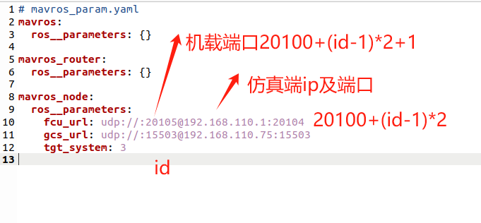
</p>
修改仿真脚本中飞机id及机载端ip地址
<div style="display: flex; justify-content: space-between;">
  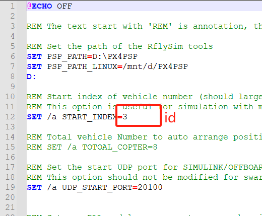
  
</div>
启动仿真脚本
<div align="center">

</div>
启动机载端程序按以上使用中第2种以脚本方式运行
<p align="center">

</p>
启动分布式地面站
<div style="display: flex; justify-content: space-between;">
  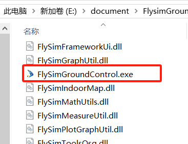
  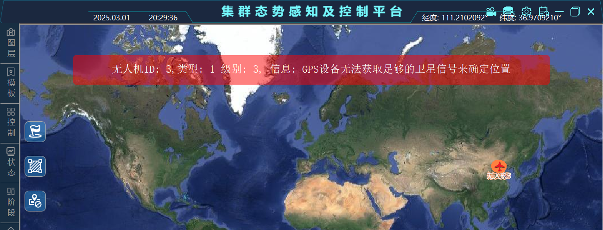
  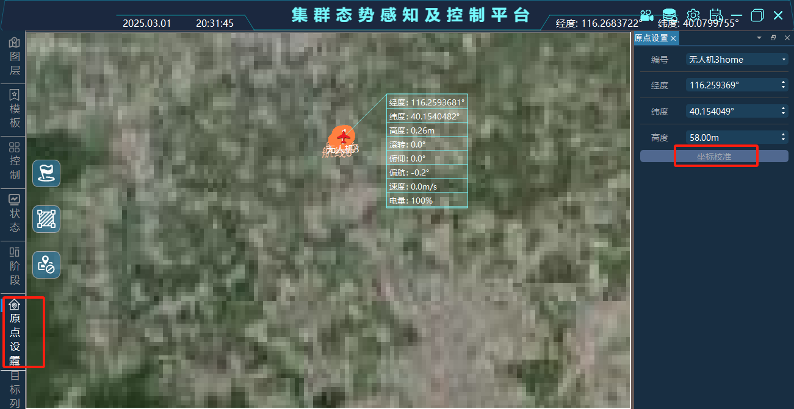
</div>
-   发送起飞任务
<div style="display: flex; justify-content: space-between;">
  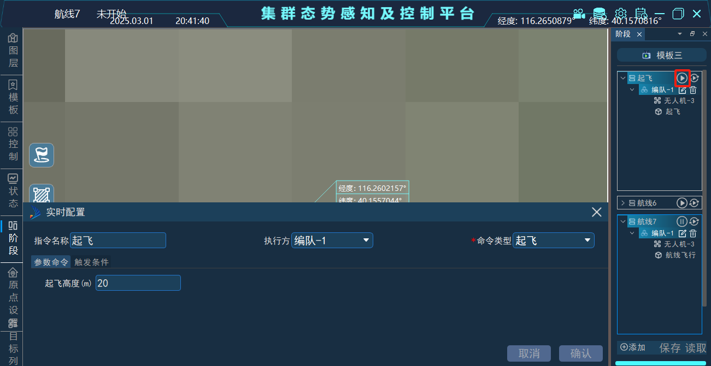
  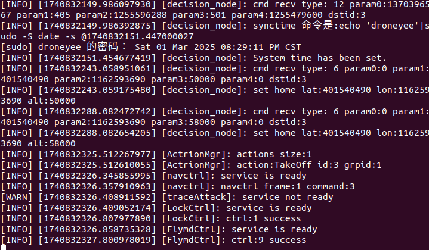
</div>
-   发送航线任务
<div style="display: flex; justify-content: space-between;">
  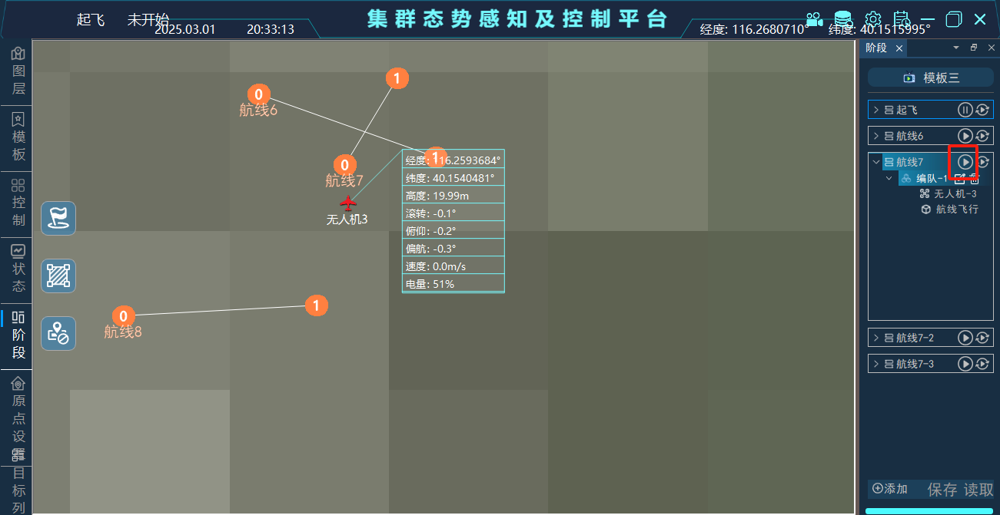
  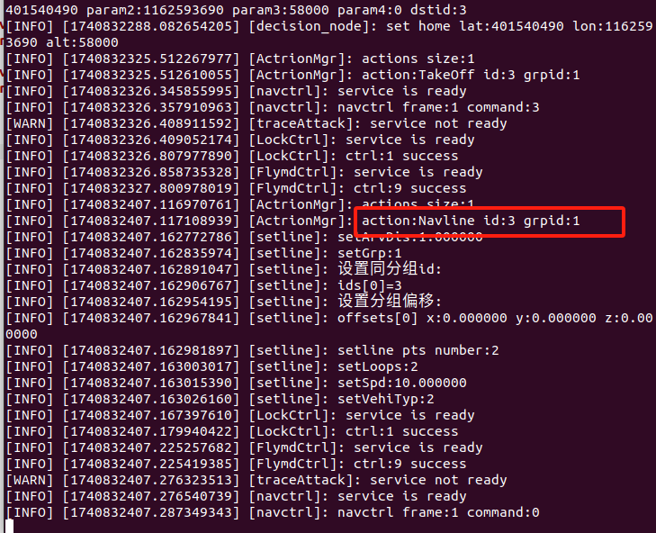
</div>
##其它
###配置说明
配置文件存放在~/ros2_ws/src/behavior-process/tree/config.json中，其中
-  plugins
列举出需要包含的扩展插件
name：表示插件名(为库去掉lib前缀及.so后缀后的字符串)
actions：表示该插件支持的行为名列表(行为名需要和地面站配置的行为名一致)
-  xmlFiles
列举出全部行为树组成的xml文件，如果文件B中的包含的子树 在文件A中，文件A需要放到文件B前

-  coreActions
列举出了由行为基础库响应的行为列表，如想将此中某行为在扩展插件中响应，则需从此列表去掉该行为
<div align="center">
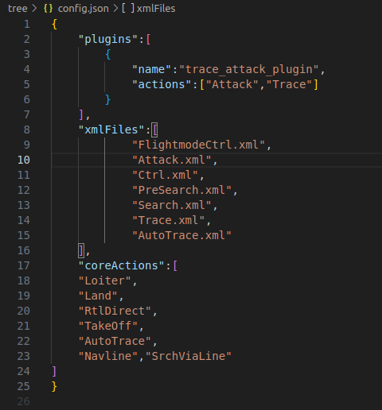
</div>
###行为插件开发说明
可利用BehaviorTree.CPP、行为基础库core_plugin进行扩展插件开发。开发分为插件申明及实现、编译、行为树xml文件编写及配置使用
-  申明及实现
可在include/actions_lib中添加插件类头文件，在src/actions_lib中添加cpp源文件进行实现，插件类需继承自zyzn::plugin::BasePlugin
可依据实际情况重写如下接口
```

   @brief 从json中解析任务参数
   @param in json串
   @return 是否解析成功，参数是否有效
  virtual bool parseJsonParam(const Json::Value &params);

   @brief 注册行为树节点,注册插件中所有行为树节点
   @param factory 行为树工厂
  virtual void registerNode(BT::BehaviorTreeFactory &factory);
  
 
   @brief 处理命令指令
   @param in msg 指令
   @param out treeName 需要用行为树执行时，行为树名称
   @return 是否处理成功，如果返回true，则后续插件不再处理该指令
  virtual bool procCmd(const custom_msgs::msg::CommandRequest::SharedPtr msg,std::string & treeName);

   @brief 处理遥杆指令
   @param out treeName 需要用行为树执行时，行为树名称
   @return 是否处理成功，如果返回true，则后续插件不再处理该指令
  virtual bool procJoyCtrl(std::string & treeName);

   @brief 处理跟踪攻击指令
   @param in msg 指定跟踪打击目标信息
   @param out treeName 需要用行为树执行时，行为树名称
   @return 是否处理成功，如果返回true，则后续插件不再处理该指令
  virtual bool procTraceAttack(const custom_msgs::msg::ObjectAttackDesignate::ConstSharedPtr msg,std::string & treeName);
```
<div style="display: flex; justify-content: space-between;">
  
  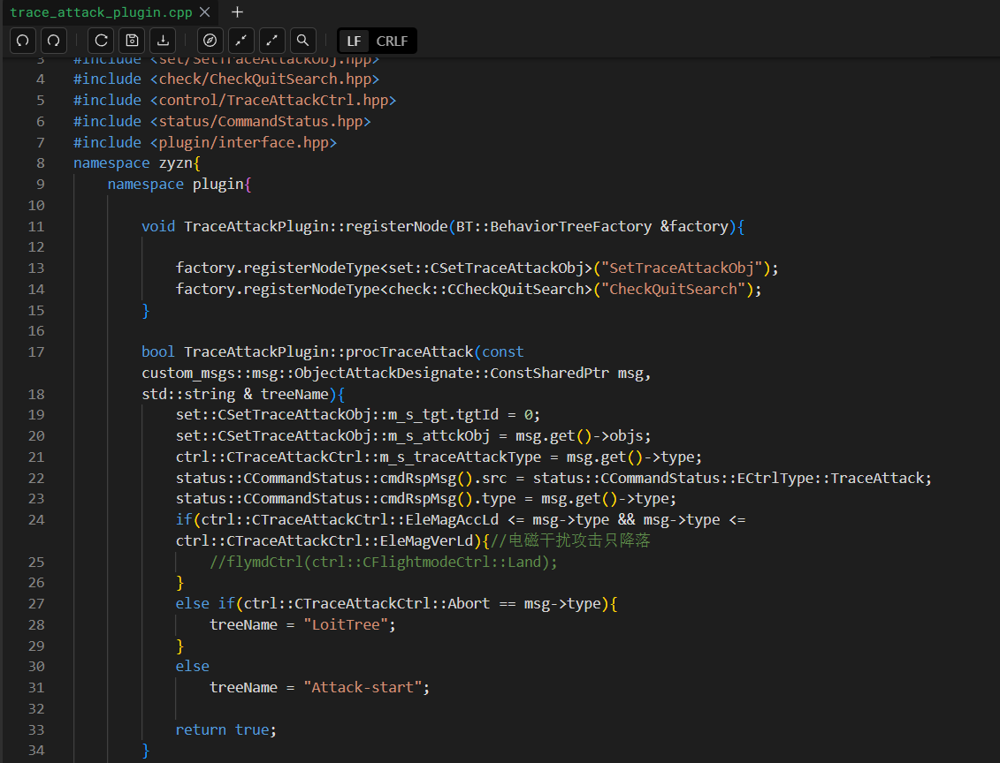
</div>
-  编译，修改CMakeLists.txt文件，添加此库的编译，另外确保编译后自动将库拷贝到~/ros2_ws/install/behavior-process/lib/behavior-process/tree目录中
<div align="center">
  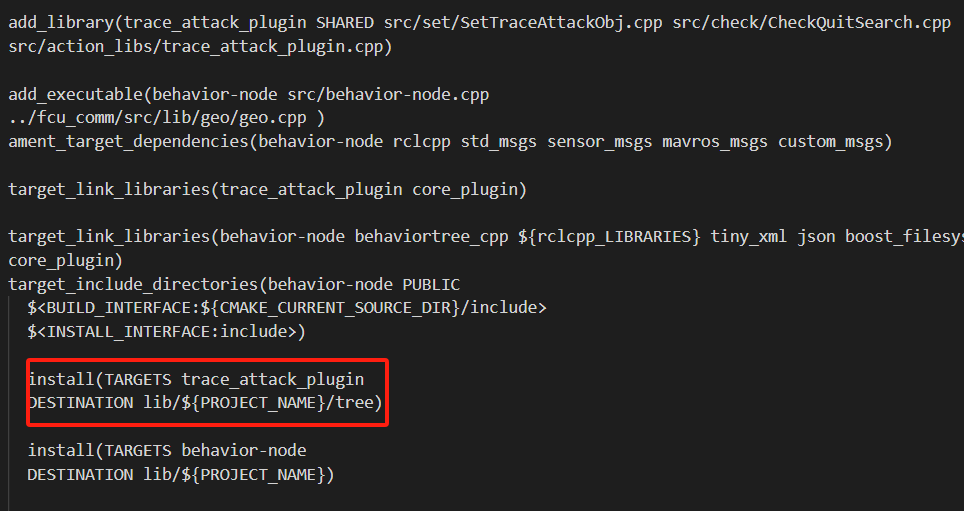
</div>
-  行为树xml文件编写，应该依据BehaviorTree.CPP中行为树xml文件的书写规则将此插件涉及的行为节点进行组织
行为树名格式为：行为名-cmd（其中cmd可为start、pause、continue、stop对应下发json任务中cmd，分别表示任务开始、暂停、继续、停止)
<div style="display: flex; justify-content: space-between;">
  
  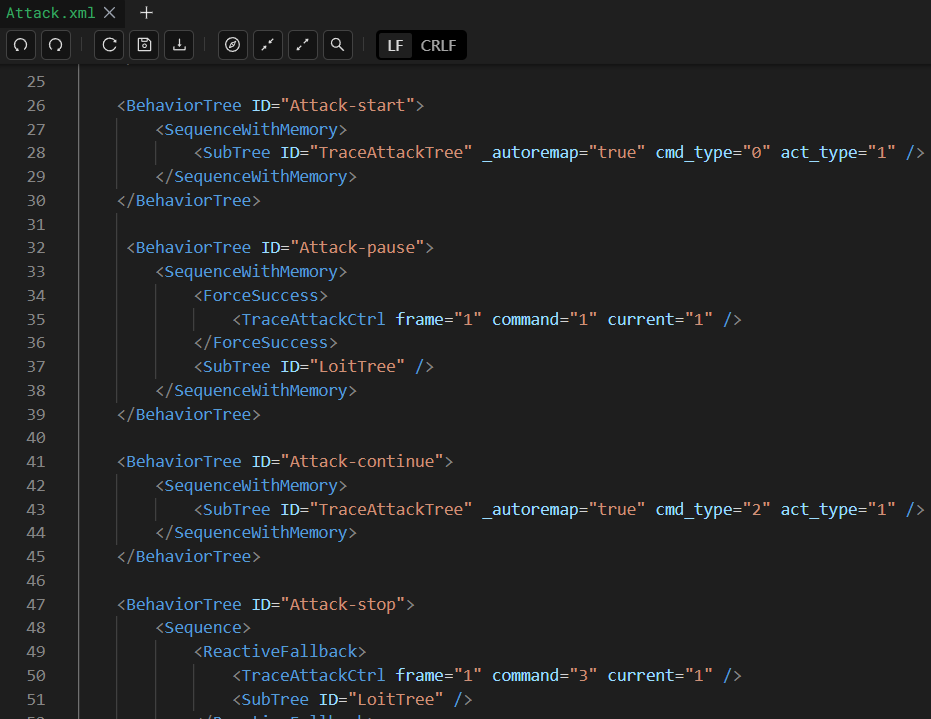
</div>
-  配置使用，修改config.json文件将插件名及其支持的行为名添加到文件的plugins中

####具体示例可参考跟踪打击插件


