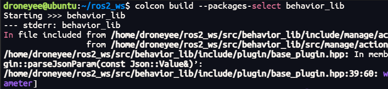
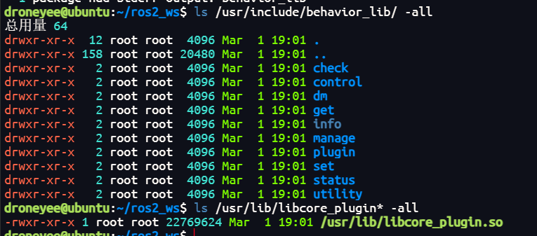
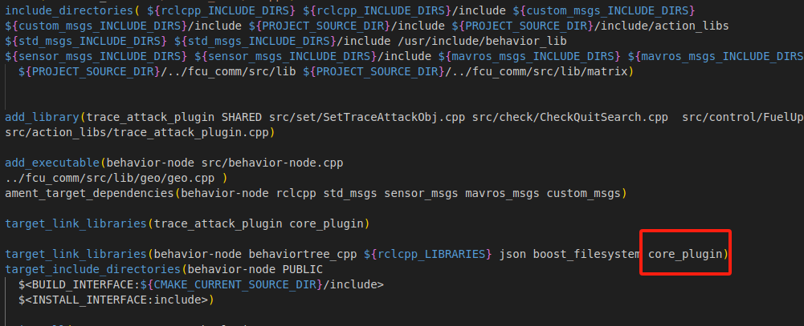
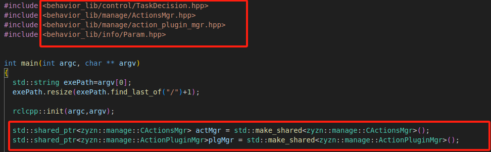

# behavior_lib

## 介绍
行为控制程序使用的基础库包括基础行为节点、json任务解析、插件管理

## 依赖
###Behavior.CPP
可选择源码编译安装或二进制安装
####源码安装
行为树库，现机载使用的版本存放在钉钉项目中链接为：
https://alidocs.dingtalk.com/i/nodes/jb9Y4gmKWrbo9pRLHKrn5M59WGXn6lpz?utm_scene=team_space
如下为行为树库的编译及安装，默认安装后头文件存放在/usr/local/include/
behaviortree_cpp，库文件存放在/usr/local/lib/libbehaviortree_cpp.so
```
tar -xzvf BehaviorTree.CPP-master.tar.gz
cd BehaviorTree.CPP-master
mkdir build
cd build
cmake ../
make
sudo make install
```
####二进制安装
从钉钉下载二进制包
https://alidocs.dingtalk.com/i/nodes/KGZLxjv9VGd9olnDt9qeo5AzJ6EDybno?utm_scene=team_space
```
tar -xzvf behaviorcpp.tar.gz
sudo cp -fr behaviortree_cpp /usr/local/include/
sudo cp libbehaviortree_cpp.so /usr/local/lib/
```

###json库
参考 https://e.coding.net/g-zkva6329/jiqunfenbushi/common.git中说明
###custom_msgs库
为分布式机载端自定义ros2消息库，参考https://e.coding.net/g-zkva6329/jiqunfenbushi/custom_msgs.git

## 编译
先将仓库clone到~/ros2_ws/src目录中
~~~
cd ~/ros2_ws
colcon build --packages-select behavior_lib
~~~
<p center>

</p>
###编译完成后会自动进行头文件及库文件的拷贝
*  头文件拷贝到/usr/include/behavior_lib目录下
*  库文件libcore_plugin.so拷贝到/usr/lib目录下
<p center>

</p>

## 使用
-  使用程序的CMakeLists.txt添加包含依赖库core_plugin
-  代码中包含需要的头文件
<div style="display: flex; justify-content: space-between;">
  
  
</div>


