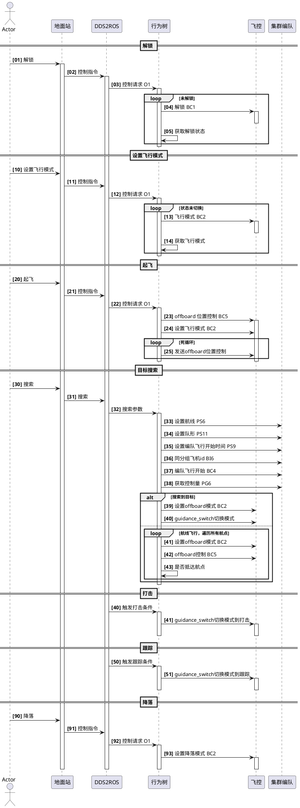
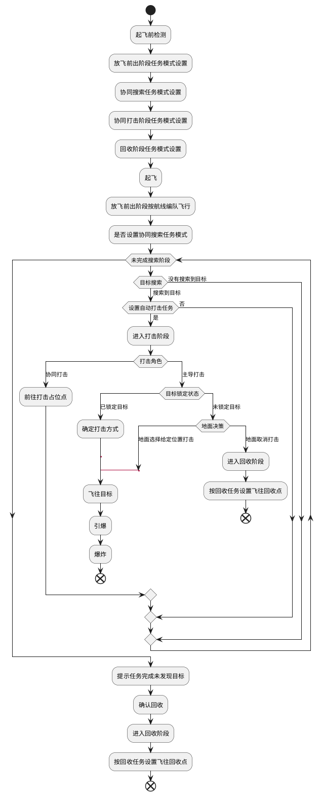

# 方案设计

[toc]

## 总体设计

### 基本控制流程



## 整体工作流程信息



1. 起飞前检测

   检测飞机连接状态、飞机连接状态是否正常，是否存在电量不足、定位丢失、磁罗盘未校准、搭载载荷异常等情况，排查、解除全部故障保证飞机具备起飞条件。

1. 任务设置装订

   对本次飞行任务进行装订，任务分阶段，包括放飞前出、协同搜索、协同打击及回收阶段。方法前出阶段装订内容包括到目标区域的航线、行进编队方式及到达目标区域点的编队方式；协同搜索阶段装订任务包括搜索目标信息（类别、威胁级别、需要协同打击飞机数量）、搜索区域（点、线、面）、搜索时长；协同打击阶段装订任务包括打击策略、是否响应协同打击、是否能请求协同打击；回收阶段装订任务包括回收航线信息装订。同时设置进入下个任务阶段的触发条件，如集结到飞行前出阶段可通过完成集结、时间触发、地面站强制控制进入下个阶段为信号；搜索到打击阶段触发条件为发现目标、

1. 起飞集结

   点击发射起飞后，所有飞机先到放飞前任务阶段航线的航点1附近按编队进行悬停集结。

1. 放飞前出任务阶段

   所有飞机到达集结点，触发任务阶段更新条件后即开始放飞前出阶段，按设置的编队方式飞往目标区域点，当全部飞机到达目标区域点后提示放飞前出阶段完成等待地面站操作或自动进入下一任务阶段。

1. 协同搜索任务阶段

   在该阶段飞机按设置的区域（点、线、面）进行区域覆盖的扫域飞行，利用目标识别进程节点对可见光相机或红外相机图片进行目标识别及目标过滤；目标位置解算节点利用探测目标信息计算目标在飞机坐标系下的位置并预估目标运动速度，进行目标上报或目标信息更新；发现目标后如设置为自动打击或接收到地面站打击指令则会进入打击任务阶段；如扫域结束后还未发现目标则依据地面操作进行响应，或自动进入回收任务阶段。

1. 协同打击任务阶段

   如目标为需要协同打击目标，飞机会向其它飞机发送协同打击请求或地面站人为指派飞机进行协同打击。协同打击时先等待全部协同飞机就为，就位完成或超过设定时间则开始进行打击；发现目标飞机为主导打击飞机，如锁定目标则按顺序对目标进行攻击；如打击过程中目标丢失，地面人员可指定位置让无人机进行碰炸，否则进入回收任务阶段。

1. 回收任务阶段

   无人机按设置回收航线飞往回收点，降落上锁后标识此次任务结束。


## 行为解析控制子系统

用于处理地面站发出的指令、设置信息；对无人机进行控制时采取行为树方式进行；该进程需要包括全部执行行为（如上接锁、飞行模式切换、是否发现目标、打击目标、跟踪目标、是否超时、航点飞行、位置控制等，全部的行为都需要调用其它进程提供的服务进行实现），配合其它控制行为（顺序、选择）、装饰行为、条件行为等完成对无人机的控制。

## ROS消息接口定义

### 机间、机地通信 Outer

#### 命令控制 O1

话题名：`outer/command/request`

消息类型名：`custom_msgs/CommandRequest`

```
uint8 src    #发送方id
uint8 dst	# 目标飞机 id (0xFF all vehicle)

uint8 grp

uint16 type

int32 param0

int32 param1
int32 param2
int32 param3
int32 param4

float32 fparam5
float32 fparam6
float32 fparam7
float32 fparam8
```

| 名称    | 说明         | 类型    | 备注            |
| ------- | ------------ | ------- | --------------- |
| srcid   | 请求发送源id | uint8   |                 |
| dstid   | 请求目的id   | uint8   | 0：表示全部飞机 |
| grpid   | 目的分组id   | uint8   | 0：表示分组无效 |
| type    | 命令类型     | uint16  |                 |
| param0  |              | int32   |                 |
| param1  |              | int32   |                 |
| param2  |              | int32   |                 |
| param3  |              | int32   |                 |
| param4  |              | int32   |                 |
| fparam5 |              | float32 |                 |
| fparam6 |              | float32 |                 |
| fparam7 |              | float32 |                 |
| fparam8 |              | float32 |                 |

#### 精简飞控信息 O2

话题名outer/information/simple_vehicle

消息类型custom_msgs/SimpleVehicle

```
uint64  time #时钟         时钟同步
uint8   type    #载具类型
uint8   grp   #组别GroupID  集群分组
uint8   id      #系统ID       飞控ID
uint8   bat     #剩余电量     0-100(%)
uint8   fix     #gps fix类型  6:已fix
uint16  volt    #电压         0.01v
uint8   sate    #星数
uint8   lock    #上锁状态     0:未锁,1:已锁
uint8   flymd   #飞行模式     0:未知,1:手动,2:定高,3:定点,4:起飞,5:降落,6:保持,7:航路,8:返航,9:Offboard,10:自稳
int32   roll    #滚转         mrad
int32   pitch   #俯仰         mrad
int32   yaw     #偏航         mrad
int32   x       #x位置        mm(Loc_pos)
int32   y       #y位置        mm
int32   z       #z位置        mm
int32   vx      #x速度        mm/s
int32   vy      #y速度        mm/s
int32   vz      #z速度        mm/s
int32   airspd  #空速         mm/s
int32   lon     #经度         degE7
int32   lat     #纬度         degE7
int32   alt     #海拔高度     mm
int32   radz    #雷达高度     mm
```

| 名称   | 说明         | 类型   | 备注                                                         |
| ------ | ------------ | ------ | ------------------------------------------------------------ |
| time   | 时钟         | uint64 | 系统时间                                                     |
| type   | 载具类型     | uint8  | 1：固定翼  2：旋翼  3：垂起-旋翼  4：垂起-固定翼  5：小车    |
| grp    | 组别id       | uint8  | 集群分组，0表示无分组                                        |
| id     | 系统ID       | uint8  | 飞机id                                                       |
| bat    | 剩余电量     | uint8  | 0-100（%）                                                   |
| fix    | gps fix-type | uint8  |                                                              |
| volt   | 电压         | uint16 | 0.01v                                                        |
| sate   | 星数         | uint8  |                                                              |
| lock   | 上锁状态     | uint8  | 0：上锁，1：未锁                                             |
| flymd  | 飞行模式     | uint8  | 0：未知     1：手动     2：定高     3：定点     4：起飞     5：降落     6：保持     7：自动航路    8：自动返航    9：OffBoard  10：自稳 |
| roll   | 滚转         | int32  | mrad                                                         |
| pitch  | 俯仰         | int32  | mrad                                                         |
| yaw    | 偏航         | int32  | mrad                                                         |
| x      | locx位置     | int32  | mm(Loc_pos)                                                  |
| y      | locy位置     | int32  | mm                                                           |
| z      | locz位置     | int32  | mm                                                           |
| vx     | x速度        | int32  | mm/s                                                         |
| vy     | y速度        | int32  | mm/s                                                         |
| vz     | z速度        | int32  | mm/s                                                         |
| airspd | 空速         | int32  | mm/s                                                         |
| lon    | 经度         | int32  | degE7                                                        |
| lat    | 纬度         | int32  | degE7                                                        |
| alt    | 海拔高度     | int32  | mm                                                           |
| radz   | 雷达高度     | int32  | mm                                                           |

#### 设置任务阶段 O3

话题名outer/set/task_stage

消息类型custom_msgs/TaskStage.msg

```
custom_msgs/StageHead head                #飞机id
uint8 scopetype	                          #任务阶段
geometry_msgs/Polygon line           #阶段标识

float32 maxspd                            #最大飞行速度 m/s

custom_msgs/ParamShort trigger        #任务触发条件

custom_msgs/ParamShort form           #编队队形
geometry_msgs/Polygon formoffset     #偏移编队时各飞机偏移量
custom_msgs/ObjectFilter objs         #目标信息
```

| 名称       | 说明                     | 类型                         | 备注                                                         |
| ---------- | ------------------------ | ---------------------------- | ------------------------------------------------------------ |
| head       | 阶段头信息               | custom_msgs/StageHead.msg    |                                                              |
| scopetype  | 区域范围类型             | uint8                        | 0：航线  1：区域（多边形）                                   |
| pointtype  | 航点类型                 | uint8                        | 0：loc  1：gps                                               |
| line       | 存放各点信息             | geometry_msgs/Point[]        |                                                              |
| maxspd     | 最大飞行速度             | float32                      | 编队飞行时虚拟点最大移动速度，0：不限制速度                  |
| trigger    | 阶段任务执行触发条件     | custom_msgs/ParamShort.msg   | type值定义： <br />0：约定时间触发  param1:UTC时间s（低4字节）  param2:UTC时间s（高4字节） <br />1：前阶段完成后延迟某段时间触发（s）值为负数时使用默认值（10s）  param1:延迟时间  <br />  2：手动触发<br />  3：自动触发 |
| form       | 编队队形                 | custom_msgs/ParamShort.msg   | type值定义  0：偏移量（虚拟结构法）  1：椭圆队形  参数1：短轴半径，单位mm  参数2：长轴半径，单位mm  2：方形队形  参数1：方形长度，单位mm  参数2：方形宽度，单位mm  3：三角形  参数1：三角形边长，单位mm  4：水平一字形  参数1：飞机间隔，单位mm  5：竖直一字形  参数2：飞机间隔，单位mm  6：8字形  参数1：短轴长度，单位mm  参数2：长轴长度，单位mm  7：无队形 |
| formoffset | 偏移量编队时各飞机偏移量 | geometry_msgs/ Polygon.msg   | 每个值对应分组中各飞机偏移值  此字段只对偏移量编队有效       |
| objs       | 目标信息                 | custom_msgs/ObjectFilter.msg | 用于搜索及打击阶段不能关闭目标识别，  前突和返航阶段一般可关闭目标识别， |

```
#custom_msgs/ParamShort.msg
uint16 type

int32 param1
int32 param2
int32 param3
int32 param4
```

```
#custom_msgs/StageHead.msg
uint8 grpid       #分组编号
uint8[] ids	      #分组内全部飞机id
uint8 stage       #任务阶段
uint8 tag         #阶段标识 0：前突 1：搜索 3：打击 4：返航
```

#### 请求回复 O4

话题名outer/command/response

消息类型custom_msgs/CommandResponse

```
uint8 id        #发送飞机id
uint8 src       #请求源id
uint16 type     #请求类型

uint16 status   #请求命令执行结果
string rslt     #结果信息
```

| 名称   | 说明             | 类型   | 备注                                               |
| ------ | ---------------- | ------ | -------------------------------------------------- |
| id     | 发送飞机id       | uint8  | 本机id，表示回复机id                               |
| src    | 请求源id         | uint8  | 收到的命令请求消息中的src，表示该命令请求来源      |
| type   | 请求命令类型     | uint16 | 同收到的命令请求消息中type一致，表示对该命令的回复 |
| status | 请求命令执行结果 | uint16 | 0：执行成功  1：执行失败                           |
| rslt   | 结果附加信息     | string |                                                    |

#### 任务信息 O6

话题名outer/information/status_task

消息类型名custom_msgs/StatusTask.msg

```
uint8 id          #飞机id
uint8 stage	      #任务阶段
uint8 tag         #阶段标识

uint8 status      #任务状态

uint16 dstwaypt   #目标航点id

uint32 diswaypt   #距离目标航点距离
uint32 disobj     #距离目标距离
uint32 obj        #目标id
```


| 名称     | 说明             | 类型   | 备注                                                         |
| -------- | ---------------- | ------ | ------------------------------------------------------------ |
| id       | 飞机id           | uint8  |                                                              |
| stage    | 任务阶段         | uint8  |                                                              |
| tag      | 阶段标识         | uint8  | 0：前突  1：搜索  3：打击  4：返航                           |
| status   | 任务状态         | uint8  | 0：未开始  1：正在进行  2：失败  3：完成  4：不具备执行条件  5：等待手动确认操作 |
| dstwaypt | 目标航点id       | uint16 | 0-*                                                          |
| diswaypt | 距离目标航点距离 | uint32 | mm                                                           |
| disobj   | 距离目标距离     | uint32 | mm，跟踪、打击目标时有效                                     |
| obj      | 目标id           | uint32 | 跟踪打击目标时有效，0时表示目标丢失                          |

#### 目标位置信息 O7

其它飞机上报的目标信息

话题名outer/information/object_computation

消息类型custom_msgs/ObjectComputation.msg

```
std_msgs/Header header
ObjectLocation[] objs
int16 select_offset  # Negative value means no selected target
float32 fix_tar_ned_azi_deg 
float32 fix_tar_ned_ele_deg #Up is Positive
```

解算目标消息

ObjectComputation.msg

| 名称 | 说明 | 类型             | 备注                 |
| ---- | ---- | ---------------- | -------------------- |
| objs | 目标 | ObjectLocation[] | 多个目标位置解算信息 |

目标位置消息

ObjectLocation.msg

| 名称   | 说明              | 类型   | 备注                     |
| ------ | ----------------- | ------ | ------------------------ |
| id     | 身份id            | uint32 |                          |
| cls    | 分类              | uint16 | 使用识别目标消息的对应值 |
| subcls | 子分类            | uint8  | 使用识别目标消息的对应值 |
| score  | 分类得分          | uint8  | 0-100                    |
| x      | 目标locx值        | int32  | mm                       |
| y      | 目标locy值        | int32  | mm                       |
| z      | 目标locz值        | int32  | mm                       |
| vx     | 目标速度x分量预估 | int32  | mm/s                     |
| vy     | 目标速度y分量预估 | int32  | mm/s                     |
| vz     | 目标速度z分量预估 | int32  | mm/s                     |

####  指定目标打击 O8

话题名outer/set/attack_object_designate

消息类型custom_msgs/ObjectAttackDesignate.msg

```
uint8 grpid
uint8[] ids
uint8 type
custom_msgs/ObjectLocation objs
```

| 名称  | 说明           | 类型               | 备注                                                   |
| ----- | -------------- | ------------------ | ------------------------------------------------------ |
| grpid | 分组id         | uint8              |                                                        |
| ids   | 分组内飞机信息 | uint8[]            |                                                        |
| type  | 目标打击方式   | uint8              | 0：同时打击，1：分时打击,2:跟踪，3：只下发融合目标信息 |
| objs  | 目标信息       | ObjectLocation.msg | 需要打击目标,参考7.2.2.2                               |

#### 指定阶段信息(json) O9

话题名outer/set/stage_info_json

消息类型std_msgs/String.msg

### 机内部通信 Inner

#### 上锁解锁服务调用（服务） BC1 

服务名inner/control/lock_unlock

消息类型名custom_msgs/CommandBool.srv

```
bool value 0：解锁 1：上锁
---
bool success
uint8 result
```

#### 设置飞行模式 （服务） BC2

话题名inner/control/set_flymode

消息类型名custom_msgs/CommandLong.srv

```
bool broadcast # send this command in broadcast mode

uint16 command # 1：手动 2：定高 3：定点 4：起飞 5：降落 6：保持 7：自动航路 8：自动返航 9：OffBoard 10：自稳

uint8 confirmation
float32 param1
float32 param2
float32 param3
float32 param4
float32 param5	# x_lat 单位deg
float32 param6	# y_lon 单位deg
float32 param7	# z_alt 起飞高度，单位m
---
bool success
# raw result returned by COMMAND_ACK
uint8 result

```

#### 制导控制切换（跟踪、打击）（服务） BC3

话题名inner/control/guidance_switch

消息类型名custom_msgs/CommandInt.srv

```
# Generic COMMAND_INT

bool broadcast # send this command in broadcast mode

uint8 frame
uint16 command
uint8 current
uint8 autocontinue
float32 param1
float32 param2
float32 param3
float32 param4
int32 x	# latitude in deg * 1E7 or local x * 1E4 m
int32 y	# longitude in deg * 1E7 or local y * 1E4 m
float32 z	# altitude
---
bool success
```

frame #0：只计算offboard控制量，不进行控制 1：进行实际offboard控制
command #0：开始 1：暂停 2：继续 3：停止 
current #0：跟踪 1：打击

#### 编队控制切换（服务）BC4

服务名inner/control/form_switch

消息类型名custom_msgs/CommandInt.srv

frame值定义如下:

0：只计算offboard控制量，不进行控制

1：进行实际offboard控制

command值定义如下:

0：开始

1：暂停

2：继续

3：停止

#### offboard控制 BC5

话题名inner/control/offboard

消息类型名custom_msgs/OffboardCtrl.msg

指令有效位：顺序下排，姿态第一位

```
uint16  ordmask  #指令有效位 Bits
float32 roll     #横滚  rad
float32 pitch    #俯仰  rad
float32 yaw      #偏航  rad
float32 throttle #油门  取值：0到1
float32 x        #位置 m(Loc_pos)
float32 y        #位置 m
float32 z        #位置 m
float32 vx       #速度 m/s
float32 vy       #速度 m/s
float32 vz       #速度 m/s
float32 airspd   #空速  m/s
float32 lon      #经度  deg
float32 lat      #纬度  deg
float32 alt      #海拔高度 m
```

loc位置控制=0x70,//16|32|64

loc位置+yaw控制=0x74,//4|16|32|64

速度控制(vx,vy,vz)=0x0380,//128|256|512

速度+yaw控制=0x0384,//4|128|256|512

姿态控制=0x0F,//1|2|4|8,

 gps位置控制=0x3800,//2048|4096|8192

#### 识别目标 BI1

话题名inner/information/object_recognition

消息类型custom_msgs/ObjectRecognition

ObjectRecognition.msg

| 名称   | 说明     | 类型                   | 备注                   |
| ------ | -------- | ---------------------- | ---------------------- |
| header | 时间戳等 | std_msgs/Header header |                        |
| objs   | 目标     | ObjectBoxInfo[]        | 多个目标lable及box信息 |

 

目标信息消息

ObjectBoxInfo.msg

| 名称   | 说明                   | 类型   | 备注                              |
| ------ | ---------------------- | ------ | --------------------------------- |
| id     | 身份id                 | uint32 |                                   |
| cls    | 分类                   | uint16 | 人、车、动物等  目标分类参考附录C |
| subcls | 子分类                 | uint8  | 装甲车、轿车等                    |
| score  | 分类得分               | uint8  | 0-100                             |
| tpx    | 目标box左上x像素点位置 | uint16 |                                   |
| tpy    | 目标box左上y像素点位置 | uint16 |                                   |
| width  | 目标box宽度            | uint16 |                                   |
| height | 目标box高度            | uint16 |                                   |

#### 目标信息解算 BI2

话题名inner/information/object_computation

消息类型custom_msgs/ObjectComputation

 

解算目标消息

ObjectComputation.msg

| 名称 | 说明 | 类型             | 备注                 |
| ---- | ---- | ---------------- | -------------------- |
| objs | 目标 | ObjectLocation[] | 多个目标位置解算信息 |

目标位置消息

ObjectLocation.msg

| 名称   | 说明              | 类型   | 备注                     |
| ------ | ----------------- | ------ | ------------------------ |
| id     | 身份id            | uint32 |                          |
| cls    | 分类              | uint16 | 使用识别目标消息的对应值 |
| subcls | 子分类            | uint8  | 使用识别目标消息的对应值 |
| score  | 分类得分          | uint8  | 0-100                    |
| x      | 目标locx值        | int32  | mm                       |
| y      | 目标locy值        | int32  | mm                       |
| z      | 目标locz值        | int32  | mm                       |
| vx     | 目标速度x分量预估 | int32  | mm/s                     |
| vy     | 目标速度y分量预估 | int32  | mm/s                     |
| vz     | 目标速度z分量预估 | int32  | mm/s                     |

 飞控消息 BI3

话题名inner/information/simple_vehicle

消息类型custom_msgs/SimpleVehicle

为飞机内部提供自身信息的话题，消息类型同外部精简飞控消息 O2

#### 邻居飞机（全部其它飞机）id信息 BI5

话题名：inner/information/neighbor_ids

数据类型：std_msgs/Uint8MultiArray.msg

#### 同分组内飞机id信息 BI6

话题名：inner/information/group_ids

数据类型：std_msgs/Uint8MultiArray.msg

#### 同分组内飞机偏移量队形偏移值

话题名：inner/information/group_offset

数据类型：geometry_msgs/ Polygon.msg

#### 航点信息

话题名/inner/information/way_point

消息类型custom_msgs/ DisTarget.msg

qos:SensorDataQos

#### 坐标对准 PS1

话题名inner/set/coord_calibration

消息类型名geometry_msgs/Point.msg

x为纬度值，单位deg

y为经度值，单位deg

z为海拔高度值，单位m

#### 设置组id PS2

话题名inner/set/group

消息类型名std_msgs/Uint8

#### 图片分发设置 PS3

话题名inner/set/image_distribute

消息类型名custom_msgs/ImageDistribute.msg

```
uint8 type        #分发类型，0:ros话题方式,1:udp方式,2:rtsp方式,3:关闭视频分发
uint32 rcvip      #udp方式时，接收端ip
uint16 rcvport    #udp方式时，接收端端口
uint16 resx       #图像分辨率宽度
uint16 resy       #图像分辨率高度
uint8 fps         #图像帧率
```

| 名称    | 说明                      | 类型   | 备注                                                         |
| ------- | ------------------------- | ------ | ------------------------------------------------------------ |
| type    | 分发类型                  | uint8  | 0：图片以ros话题发布  1：图片以UDP方式发送出来  2：视频以rtsp流方式，飞机端开启rtsp服务  3：关闭图片、视频向外发布功能 |
| rcvip   | Udp方式发送时，接收端ip   | uint32 |                                                              |
| rcvport | Udp方式发送时，接收端端口 | uint16 |                                                              |
| resx    | 图像分辨率横向            | uint16 | 0：使用默认                                                  |
| resy    | 图片分辨率纵向            | uint16 | 0：使用默认                                                  |
| fps     | 图像帧率                  | Uint8  | 0：使用默认                                                  |

#### 目标过滤PS4

话题名inner/set/object_filter

消息类型名custom_msgs/ObjectFilter.msg

| 名称   | 说明         | 类型   | 备注                                                         |
| ------ | ------------ | ------ | ------------------------------------------------------------ |
| type   | 识别方式     | uint8  | 0：关闭目标识别功能  1：按图片内容识别（path指定文件路径）  2：按目标分        类识别  3：不进行目标过滤，识别全部能识别目标 |
| path   | 图片文件路径 | string |                                                              |
| cls    | 目标分类     | uint16 |                                                              |
| subcls | 目标子分类   | uint8  |                                                              |

 编队飞行最大速度 PS5

话题名inner/set/form_spd

消息类型名std_msgs/Float32.msg

单位m/s

#### 设置航线 PS6

话题名inner/set/navline

消息类型geometry_msgs/Polygon.msg

#### 设置多边形区域 PS7

话题名inner/set/area_polygon

消息类型geometry_msgs/Polygon.msg

#### 编队飞行开始时间 PS9

话题名inner/set/form_time

消息类型名std_msgs/Int64

设置编队飞行开始时间，UTC（ms）

#### 机间避撞距离 PS12

话题名：inner/set/dis_anti_collide

消息类型名：std_msgs/Float32

值单位m

#### 到点判断距离 PS13

话题名：inner/set/dis_arrive

消息类型名：std_msgs/Float32

值单位m

#### 设置跟踪占位偏移量 PS14

话题名：inner/set/trace_offset

消息类型名：geometry_msgs/Point32.msg

#### 设置跟踪、打击目标PS15

话题名：inner/set/trace_attack_object

消息类型名：custom_msgs/msg/ObjectLocation.msg

值为目标信息

#### 载具类型设置PS17

话题名：inner/set/vehicle_type

消息类型名：std_msgs/Uint8

1：固定翼

2：旋翼

3：垂起

4：小车

#### 设置航线循环次数PS18

话题名：inner/set/line_loops

消息类型名：std_msgs/Int32

<0 不限制次数

#### 邻居飞机节点id获取 (服务)  PG1

服务名：inner/get/neighbor_ids

数据类型：custom_msgs/GetNeighborID.srv

```
# Common type for request UInt8MultiArray 

---
std_msgs/UInt8MultiArray rslt
bool success
```

rslt：存放全部id值结果

success：是否成功

#### 获取rtsp服务地址 PG3

服务名inner/get/rtsp_url

消息类型名custom_msgs/CommandString.srv

```
# Generic COMMAND_string
# :rslt: request result
# :success:	indicates success or failed of request

---
string rslt
bool success
```

#### 获取航点信息 PG9

话题名：inner/get/waypt_dis

数据类型：custom_msgs/ GetDisTarget.srv

custom_msgs/ GetDisTarget.srv

| 名称    | 说明         | 类型                       | 备注 |
| ------- | ------------ | -------------------------- | ---- |
| rslt    | 当前航点信息 | custom_msgs/ DisTarget.msg |      |
| success | 是否成功     | bool                       |      |

 

custom_msgs/ DisTarget.msg

| 名称 | 说明                                                         | 类型   | 备注 |
| ---- | ------------------------------------------------------------ | ------ | ---- |
| id   | 目标航点id                                                   | uint32 | 0-*  |
| dis  | 距离目标航点距离（需要考虑编队偏移量，是飞机距离自己目标航点（下发航线航点+偏移之后才为自己的目标航点）） | int32  | mm   |

####  获取飞机类型PG11

服务名inner/get/type_vehicle

消息类型名custom_msgs/CommandBool.srv

rslt：存放飞机类型值
